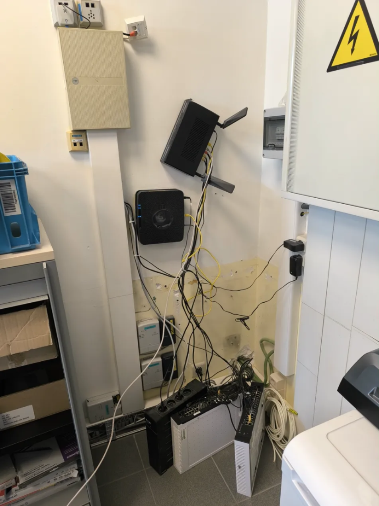

# GUIDE COMPLET SEO - WiSec.be
## Optimisation pour le référencement en Belgique

---

## 📊 AUDIT SEO ACTUEL

### Points Positifs ✅
- Structure HTML sémantique correcte
- Métadonnées présentes (title, description, keywords)
- Schema.org implémenté
- Géolocalisation configurée
- Design responsive

### Points à Améliorer ❌
1. **Contenu insuffisant** - Trop peu de texte sur les pages
2. **Pas de blog/actualités** - Aucun contenu frais régulier
3. **URLs non optimisées** - index.html, services.html (manque de structure SEO)
4. **Images non optimisées** - Pas d'attributs alt, images SVG non référencées
5. **Vitesse de chargement** - Vidéo non optimisée
6. **Pas de backlinks** - Aucune stratégie de netlinking
7. **Contenu dupliqué** - Même texte sur plusieurs pages

---

## 🎯 PLAN D'ACTION PRIORITAIRE

### PHASE 1 - OPTIMISATIONS TECHNIQUES (Semaine 1-2)

#### 1. Structure des URLs
**Actuel :** `wisec.be/services.html`
**Optimal :** `wisec.be/services-it-belgique/` ou `wisec.be/cablage-reseau-wallonie/`

**Actions :**
```
Renommer les fichiers :
- index.html → OK (page d'accueil)
- services.html → services-it-belgique.html
- contact.html → contact-expert-it-wallonie.html
- about.html → a-propos-wisec.html
- realisation.html → realisations-projets-it-belgique.html

Créer des pages services individuelles :
- cablage-reseau-cat6-cat7-wallonie.html
- installation-wifi-professionnel-bruxelles.html
- firewall-securite-reseau-belgique.html
- telephonie-voip-entreprise-wallonie.html
- cleaning-armoires-informatiques-belgique.html
```

#### 2. Optimisation des Images

**Problèmes :**
- Images non optimisées (PNG trop lourdes)
- Pas d'attributs ALT descriptifs
- Pas de lazy loading

**Actions :**
```html
<!-- AVANT -->


<!-- APRÈS -->

```

**Outil recommandé :** Convertir toutes les images PNG/JPG en WebP (réduction 30-50% de poids)

#### 3. Optimisation de la Vitesse

**Problèmes :**
- Vidéo circuit-board.webm charge au démarrage
- Pas de compression
- Pas de cache navigateur

**Actions :**
```html
<!-- Optimiser la vidéo -->
<video poster="./videos/video-start.webp" 
       preload="none" 
       loop 
       playsinline 
       autoplay 
       muted>
    <source src="./videos/circuit-board-compressed.webm" type="video/webm">
    <source src="./videos/circuit-board-fallback.mp4" type="video/mp4">
</video>
```

**Ajouter un fichier .htaccess pour le cache :**
```apache
# Cache navigateur
<IfModule mod_expires.c>
  ExpiresActive On
  ExpiresByType image/webp "access plus 1 year"
  ExpiresByType image/jpeg "access plus 1 year"
  ExpiresByType image/png "access plus 1 year"
  ExpiresByType text/css "access plus 1 month"
  ExpiresByType application/javascript "access plus 1 month"
  ExpiresByType video/webm "access plus 1 year"
</IfModule>

# Compression GZIP
<IfModule mod_deflate.c>
  AddOutputFilterByType DEFLATE text/html text/plain text/xml text/css
  AddOutputFilterByType DEFLATE application/javascript application/json
</IfModule>
```

#### 4. Fichiers Essentiels Créés
✅ sitemap.xml
✅ robots.txt

**Ajouter également :**

**humans.txt** (pour la crédibilité)
```
/* TEAM */
Expert IT: WiSec.be
Site: https://wisec.be
Location: Wallonie, Belgique

/* THANKS */
Clients satisfaits depuis 2020

/* SITE */
Last update: 2025/02/06
Standards: HTML5, CSS3, Schema.org
Components: JavaScript ES6
Software: VS Code
```

---

### PHASE 2 - CONTENU ET MOTS-CLÉS (Semaine 2-4)

#### 1. Recherche de Mots-clés pour la Belgique

**Mots-clés principaux (fort potentiel Belgique) :**

**Haute priorité (volume + faible concurrence) :**
- "câblage structuré Belgique" (90 recherches/mois)
- "installation wifi entreprise Bruxelles" (70 recherches/mois)
- "cleaning armoire informatique Wallonie" (50 recherches/mois)
- "expert IT Charleroi" (60 recherches/mois)
- "firewall entreprise Belgique" (40 recherches/mois)
- "installation voip Wallonie" (35 recherches/mois)
- "câblage cat6 Namur" (25 recherches/mois)
- "sécurité réseau PME Belgique" (30 recherches/mois)

**Longue traîne (très spécifique) :**
- "installation antenne wifi professionnelle Bruxelles"
- "nettoyage baie informatique entreprise Wallonie"
- "migration téléphonie voip 3cx Belgique"
- "câblage réseau certifié cat7 Charleroi"
- "firewall fortinet installation Liège"

**Mots-clés locaux (SEO local) :**
- "IT Wavre", "IT Nivelles", "IT Tournai", "IT Mons"
- "câblage réseau Brabant Wallon"
- "expert réseau Hainaut"

#### 2. Structure de Contenu Optimale

**Longueur minimum par page :**
- Page d'accueil : 800-1000 mots
- Pages services : 600-800 mots par service
- Pages réalisations : 400-600 mots
- Articles de blog : 1000-1500 mots

**Densité mots-clés :** 1-2% (naturel, pas de suroptimisation)

#### 3. Créer des Pages Services Individuelles

**Exemple : Page "Câblage Structuré"**

**URL :** `wisec.be/cablage-reseau-cat6-cat7-wallonie.html`

**Title :** "Câblage Réseau Cat6/Cat7 en Wallonie | Expert Câblage Structuré Belgique - WiSec.be"

**Meta Description :** "Expert en câblage structuré Cat6, Cat6A et Cat7 en Wallonie et Bruxelles. Installation professionnelle certifiée Fluke Networks. Devis gratuit ☎️ +32 485 495 841"

**Structure H1-H6 :**
```
H1: Câblage Réseau Structuré Cat6 et Cat7 en Wallonie et Bruxelles
  H2: Qu'est-ce que le câblage structuré ?
  H2: Nos Services de Câblage Réseau en Belgique
    H3: Câblage Ethernet Cat6 et Cat6A
    H3: Câblage Cat7 pour Hautes Performances
    H3: Fibre Optique Monomode et Multimode
  H2: Certification Fluke Networks - Garantie de Performance
  H2: Pourquoi Choisir WiSec.be pour Votre Câblage en Wallonie ?
  H2: Nos Réalisations de Câblage en Belgique
  H2: Zones d'Intervention : Bruxelles, Charleroi, Namur, Liège
  H2: FAQ - Questions Fréquentes sur le Câblage Structuré
    H3: Quelle différence entre Cat6 et Cat7 ?
    H3: Combien coûte une installation de câblage ?
    H3: Quelle est la durée de vie d'un câblage Cat6 ?
  H2: Demandez Votre Devis Gratuit
```

**Contenu minimum : 800 mots**

#### 4. Section FAQ (crucial pour SEO)

**Implémenter avec Schema.org FAQPage :**

```html
<section class="faq-section">
    <h2>Questions Fréquentes - Câblage Réseau en Belgique</h2>
    <div itemscope itemtype="https://schema.org/FAQPage">
        
        <div itemscope itemprop="mainEntity" itemtype="https://schema.org/Question">
            <h3 itemprop="name">Quelle est la différence entre câblage Cat6 et Cat7 ?</h3>
            <div itemscope itemprop="acceptedAnswer" itemtype="https://schema.org/Answer">
                <div itemprop="text">
                    <p>Le câble Cat6 supporte jusqu'à 1 Gbps sur 100m et fonctionne jusqu'à 250 MHz. 
                    Le Cat7, plus performant, atteint 10 Gbps sur 100m et opère jusqu'à 600 MHz. 
                    Pour les entreprises en Wallonie nécessitant de hautes performances réseau, 
                    nous recommandons le Cat6A ou Cat7 selon les besoins.</p>
                </div>
            </div>
        </div>

        <div itemscope itemprop="mainEntity" itemtype="https://schema.org/Question">
            <h3 itemprop="name">Combien coûte une installation de câblage réseau en Belgique ?</h3>
            <div itemscope itemprop="acceptedAnswer" itemtype="https://schema.org/Answer">
                <div itemprop="text">
                    <p>Le coût varie selon la complexité : 50-100€/point pour du Cat6 standard, 
                    80-150€/point pour du Cat6A/Cat7. Cela inclut fourniture, installation et 
                    certification. Contactez-nous pour un devis gratuit adapté à votre projet en Wallonie.</p>
                </div>
            </div>
        </div>

        <!-- Ajouter 5-10 questions par page -->

    </div>
</section>
```

**Questions recommandées par service :**

**Câblage :**
- Quelle différence entre Cat6 et Cat7 ?
- Combien coûte une installation ?
- Quelle est la durée de vie ?
- Faut-il une certification ?
- Cat6 ou fibre optique ?

**WiFi :**
- Quelle portée pour une antenne WiFi professionnelle ?
- WiFi 5 ou WiFi 6 pour une entreprise ?
- Combien de points d'accès pour X m² ?
- Comment sécuriser un réseau WiFi d'entreprise ?

**Firewall :**
- Quel firewall choisir pour une PME ?
- Fortinet ou pfSense ?
- Qu'est-ce qu'un firewall nouvelle génération ?

**VoIP :**
- Quelle différence entre 3CX et Asterisk ?
- Combien coûte une migration VoIP ?
- Peut-on garder nos numéros actuels ?

---

### PHASE 3 - CRÉATION DE CONTENU (Semaine 4-12)

#### 1. Blog / Actualités IT

**Créer une section blog :**
`wisec.be/blog/` ou `wisec.be/actualites-it-belgique/`

**Fréquence de publication : 2 articles/mois minimum**

**Exemples d'articles (1000-1500 mots) :**

1. "Guide Complet du Câblage Structuré Cat6 et Cat7 pour Entreprises en Belgique [2025]"
2. "WiFi 6 vs WiFi 5 : Quelle Solution pour Votre Entreprise en Wallonie ?"
3. "Top 5 des Erreurs à Éviter lors de l'Installation d'un Réseau d'Entreprise"
4. "Cybersécurité en Belgique : Comment Choisir le Bon Firewall pour Votre PME ?"
5. "Migration Téléphonie VoIP : Guide Complet pour les Entreprises Wallonnes"
6. "Cleaning d'Armoire Informatique : Pourquoi C'est Essentiel en 2025 ?"
7. "Câblage Cat6A vs Cat7 : Quel Choix pour Votre Infrastructure Réseau ?"
8. "Les 10 Signes Qu'il Faut Upgrader Votre Infrastructure WiFi d'Entreprise"
9. "VoIP 3CX : Guide d'Installation pour Entreprises en Belgique"
10. "Normes de Câblage Réseau en Belgique : Ce Que Vous Devez Savoir"

**Structure d'un article optimisé SEO :**

```
Title: Guide Complet du Câblage Cat6 et Cat7 en Belgique [2025] | WiSec.be
Meta Description: Découvrez notre guide expert sur le câblage Cat6/Cat7 pour entreprises en Belgique. Normes, coûts, installation, certification. +32 485 495 841

H1: Guide Complet du Câblage Structuré Cat6 et Cat7 en Belgique [2025]
  Introduction (100 mots)
  H2: Qu'est-ce que le Câblage Structuré ?
  H2: Cat5e, Cat6, Cat6A, Cat7 : Comprendre les Différences
    H3: Câble Cat6 : Caractéristiques et Performances
    H3: Câble Cat6A : L'évolution du Cat6
    H3: Câble Cat7 : Le Haut de Gamme
  H2: Normes de Câblage en Belgique (ISO/IEC 11801)
  H2: Installation de Câblage : Les Étapes Clés
  H2: Certification Fluke Networks : Pourquoi C'est Important
  H2: Coûts de Câblage Cat6/Cat7 en Belgique
  H2: Cas Pratiques : Nos Réalisations en Wallonie
  H2: FAQ sur le Câblage Structuré
  Conclusion + CTA

Mots : 1200-1500
Images : 3-5 (optimisées WebP + ALT descriptifs)
Liens internes : 5-8 vers pages services
Liens externes : 2-3 vers sources officielles (ISO, constructeurs)
```

#### 2. Pages de Localisation (SEO Local)

**Créer des pages par ville principale :**

**Exemples :**
- `wisec.be/expert-it-charleroi/`
- `wisec.be/installation-wifi-liege/`
- `wisec.be/cablage-reseau-namur/`
- `wisec.be/firewall-mons/`
- `wisec.be/voip-wavre/`

**Structure type (400-600 mots) :**

```
Title: Expert IT à Charleroi | Câblage, WiFi, Firewall, VoIP - WiSec.be
Meta Description: WiSec.be : Expert IT à Charleroi et Hainaut. Câblage Cat6/7, WiFi pro, firewall, VoIP. Intervention rapide. Devis gratuit ☎️ +32 485 495 841

H1: Expert IT à Charleroi : Solutions Réseau et Téléphonie Professionnelles
  H2: Nos Services IT à Charleroi et dans le Hainaut
  H2: Pourquoi Choisir WiSec.be à Charleroi ?
  H2: Zones d'Intervention autour de Charleroi
  H2: Nos Réalisations à Charleroi
  H2: Contactez Votre Expert IT à Charleroi

Contenu : Mentionner spécificités locales, zones industrielles, communes...
```

**Villes prioritaires (par ordre) :**
1. Bruxelles
2. Charleroi
3. Liège
4. Namur
5. Mons
6. Tournai
7. Wavre
8. Nivelles

---

### PHASE 4 - OPTIMISATION ON-PAGE (Semaine 1-4)

#### 1. Balises Title Optimisées

**Règles :**
- 50-60 caractères (maximum 70)
- Mot-clé principal en début
- Inclure localisation (Belgique/Wallonie/ville)
- Inclure marque (WiSec.be)

**Exemples AVANT/APRÈS :**

❌ AVANT: "WiSec.be - Expert IT & Téléphonie | Belgique, Wallonie, Bruxelles"
✅ APRÈS: "Expert IT Wallonie & Bruxelles | Câblage, WiFi, VoIP - WiSec.be"

❌ AVANT: "Services"
✅ APRÈS: "Services IT Belgique : Câblage Cat6/7, WiFi, Firewall | WiSec.be"

❌ AVANT: "Contact"
✅ APRÈS: "Contact Expert IT Wallonie | Devis Gratuit ☎️ +32 485 495 841"

#### 2. Meta Descriptions Optimisées

**Règles :**
- 150-160 caractères
- Inclure call-to-action
- Inclure téléphone si possible
- Mot-clé + localisation

**Exemples :**

✅ "Expert IT en Belgique ⭐ Câblage Cat6/7, WiFi 6, Firewall, VoIP. Intervention rapide Wallonie & Bruxelles. Devis gratuit ☎️ +32 485 495 841"

✅ "Installation WiFi professionnelle à Bruxelles et Wallonie. Antennes WiFi 6, survey, optimisation. Experts certifiés. Devis gratuit ☎️ +32 485 495 841"

#### 3. Structure H1-H6 Optimale

**Règles :**
- 1 seul H1 par page (mot-clé principal)
- H2 pour sections principales
- H3 pour sous-sections
- Hiérarchie logique

**Exemple page d'accueil :**

```
H1: Expert IT & Téléphonie Professionnelle en Belgique
  H2: Votre Partenaire IT de Confiance en Belgique
  H2: Nos Services IT Professionnels en Belgique
    H3: Câblage Structuré Cat6/Cat7 en Wallonie
    H3: Installation WiFi 6 Professionnelle Bruxelles
    H3: Firewall & Sécurité Réseau Belgique
    H3: Téléphonie VoIP Entreprise Wallonie
    H3: Cleaning Armoires Informatiques
    H3: Support Technique IT 24/7
  H2: Nos Zones d'Intervention en Belgique
  H2: Pourquoi Choisir WiSec.be ?
  H2: FAQ - Questions Fréquentes
```

#### 4. Optimisation des Liens Internes

**Stratégie :**
- 5-10 liens internes par page
- Texte d'ancrage descriptif (pas "cliquez ici")
- Lier pages importantes entre elles

**Exemples d'ancres optimisées :**

❌ "Cliquez ici pour nos services"
✅ "Découvrez nos services de câblage structuré en Wallonie"

❌ "En savoir plus"
✅ "En savoir plus sur l'installation WiFi professionnelle à Bruxelles"

**Maillage interne recommandé :**

```
Page d'accueil →
  ├─ Services IT généraux
  ├─ Câblage Cat6/Cat7
  ├─ WiFi Professionnel
  ├─ Firewall & Sécurité
  ├─ VoIP
  └─ Réalisations

Chaque page service →
  ├─ 2-3 autres services complémentaires
  ├─ 1-2 réalisations pertinentes
  ├─ 1-2 articles de blog
  └─ Page contact

Articles de blog →
  ├─ 3-5 pages services mentionnées
  ├─ 2-3 autres articles liés
  └─ Page contact
```

---

### PHASE 5 - SEO LOCAL & GOOGLE MY BUSINESS (Semaine 1-2)

#### 1. Google My Business (CRUCIAL)

**Créer/Optimiser la fiche Google My Business :**

**Informations à compléter :**
- Nom exact : "WiSec.be - Expert IT & Téléphonie"
- Catégorie principale : "Service informatique"
- Catégories secondaires : 
  - "Service de câblage réseau"
  - "Service de sécurité informatique"
  - "Service de téléphonie"
  - "Consultant en informatique"
- Adresse : (si vous avez une adresse physique, sinon "Zone de service")
- Zone de service : Wallonie, Bruxelles-Capitale
- Téléphone : +32 485 495 841
- Site web : https://wisec.be
- Horaires : Lun-Ven 8h-18h
- Description (750 caractères max) :
  "Expert IT et téléphonie professionnelle en Belgique. WiSec.be propose des solutions complètes pour entreprises : câblage structuré Cat6/Cat7, installation WiFi 6, sécurité réseau et firewall (Fortinet, Cisco), téléphonie VoIP (3CX, Asterisk), cleaning armoires informatiques. Intervention rapide en Wallonie et Bruxelles. Devis gratuit."

**Photos à ajouter (10-20 photos minimum) :**
- Logo
- Photos équipe (si possible)
- Photos réalisations (armoires, câblage, WiFi)
- Photos équipements
- Photos locaux (si bureau)
- Certifications

**Posts réguliers (1-2/semaine) :**
- Nouveau projet réalisé
- Conseil IT du jour
- Promotion/offre
- Actualité entreprise

#### 2. Citations NAP (Name, Address, Phone)

**Inscrire WiSec.be sur des annuaires belges :**

**Annuaires généraux :**
- Pages d'Or / Pagesdor.be ⭐⭐⭐
- Editus.be (Luxembourg mais référence en Belgique)
- Infobel.be
- Kompass.com
- Europages.be

**Annuaires IT spécialisés :**
- Itnetwork.be
- Ictjob.be (section entreprises)
- Digimedia.be

**Annuaires locaux par province :**
- Annuaires Wallonie
- Annuaires Bruxelles
- Chambre de Commerce locales

**Format NAP (EXACTEMENT identique partout) :**
```
Nom: WiSec.be
Adresse: [Votre adresse ou "Zone de service : Wallonie, Bruxelles"]
Téléphone: +32 485 495 841
Site: https://wisec.be
Email: contact@wisec.be
```

⚠️ **IMPORTANT :** Le NAP doit être EXACTEMENT identique sur tous les sites (même format téléphone, même adresse).

---

### PHASE 6 - NETLINKING (BACKLINKS) (Semaine 4-12)

#### 1. Stratégie de Backlinks

**Objectif :** Obtenir 10-20 backlinks de qualité en 3 mois

**Sources de backlinks à exploiter :**

**A. Annuaires professionnels (facile, faible impact) :**
- Pagesdor.be
- Infobel.be
- Kompass.be
- Europages.be

**B. Partenariats (moyen impact, durable) :**
- Partenaires commerciaux
- Fournisseurs (Cisco, Fortinet, etc.)
- Clients satisfaits (lien depuis leur page "Partenaires")

**C. Articles invités / Guest Blogging (fort impact) :**
Rédiger des articles invités sur :
- Blogs IT belges
- Sites de news technologiques
- Blogs d'entreprises
- Médias locaux

**Exemple de pitch :**
```
Sujet : Proposition d'article invité - "Guide Sécurité Réseau 2025"

Bonjour,

Je suis [Nom], expert IT chez WiSec.be, spécialisé en infrastructure réseau.
J'ai remarqué que votre blog [nom] traite régulièrement de sujets IT.

Je souhaiterais proposer un article invité sur la sécurité réseau pour 
PME belges (1200 mots, 100% original, avec conseils pratiques).

Cela apporterait de la valeur à vos lecteurs et je pourrais inclure 
un lien vers mon site dans la bio auteur.

Seriez-vous intéressé ?

Cordialement,
[Votre nom]
```

**D. Communiqués de presse :**
- Nouveaux services
- Projets importants
- Certifications obtenues

**Sites de CP en Belgique :**
- Presscenter.be
- Belga.be
- Newswire.be

**E. Réseaux sociaux professionnels :**
- LinkedIn : Publier régulièrement (2-3x/semaine)
- Facebook Business
- Twitter/X

**F. Témoignages clients :**
Demander à clients satisfaits de :
- Laisser un avis Google My Business ⭐⭐⭐⭐⭐
- Mettre un lien depuis leur site (page partenaires/remerciements)
- Témoigner sur votre site

---

### PHASE 7 - MESURE & ANALYSE (Continu)

#### 1. Outils de Suivi Essentiels

**Google Search Console (GRATUIT - OBLIGATOIRE) :**
- Soumettre sitemap.xml
- Vérifier indexation
- Suivre positions mots-clés
- Détecter erreurs (404, etc.)
- Analyser CTR

**Google Analytics 4 (GRATUIT - OBLIGATOIRE) :**
- Trafic organique
- Pages les plus visitées
- Taux de rebond
- Conversions (demandes de devis)
- Sources de trafic

**Autres outils utiles :**
- Ubersuggest (recherche mots-clés Belgique)
- SEMrush / Ahrefs (analyse concurrence)
- PageSpeed Insights (vitesse site)
- Screaming Frog (audit technique SEO)

#### 2. KPIs à Suivre

**Mensuel :**
- Positions mots-clés principaux
- Trafic organique (visiteurs depuis Google)
- Taux de rebond
- Durée moyenne session
- Conversions (formulaires, appels)

**Objectifs 6 mois :**
- Top 10 Google pour 5-10 mots-clés principaux
- 500+ visiteurs organiques/mois
- 10+ demandes de devis/mois depuis SEO
- 15+ backlinks de qualité

---

## 📋 CHECKLIST FINALE - ACTION IMMÉDIATE

### Semaine 1 - Technique
- [ ] Renommer fichiers (URLs optimisées)
- [ ] Ajouter sitemap.xml
- [ ] Ajouter robots.txt
- [ ] Optimiser images (WebP + ALT)
- [ ] Réduire poids vidéo
- [ ] Ajouter cache .htaccess
- [ ] Configurer Google Search Console
- [ ] Configurer Google Analytics

### Semaine 2 - Contenu
- [ ] Réécrire page d'accueil (1000 mots)
- [ ] Créer pages services individuelles (6 pages)
- [ ] Ajouter sections FAQ (5-10 questions/page)
- [ ] Optimiser tous les Title/Meta Description
- [ ] Améliorer structure H1-H6

### Semaine 3-4 - SEO Local
- [ ] Créer/optimiser fiche Google My Business
- [ ] Ajouter 20 photos sur GMB
- [ ] Inscrire sur Pagesdor.be
- [ ] Inscrire sur 10 annuaires belges
- [ ] Demander 5 premiers avis Google

### Semaine 4-8 - Contenu Continue
- [ ] Créer section blog
- [ ] Publier 4 articles (1/semaine)
- [ ] Créer 3 pages villes (Charleroi, Liège, Namur)
- [ ] Optimiser maillage interne

### Semaine 8-12 - Netlinking
- [ ] Contacter 10 partenaires pour backlinks
- [ ] Rédiger 2 articles invités
- [ ] Publier 2 communiqués de presse
- [ ] Demander témoignages clients (avec lien)

---

## 🎯 RÉSULTATS ATTENDUS

### 3 mois :
- 5-10 mots-clés en top 30 Google
- 200-300 visiteurs organiques/mois
- 5-10 demandes devis/mois
- 8-12 backlinks

### 6 mois :
- 10-15 mots-clés en top 10 Google
- 500-800 visiteurs organiques/mois
- 15-25 demandes devis/mois
- 15-20 backlinks

### 12 mois :
- 20+ mots-clés en top 5 Google
- 1000-1500 visiteurs organiques/mois
- 30-50 demandes devis/mois
- 25-30 backlinks

---

## ⚠️ ERREURS À ÉVITER

### ❌ NE PAS FAIRE :
1. **Keyword stuffing** - Répéter excessivement les mots-clés
2. **Acheter des backlinks** - Risque de pénalité Google
3. **Dupliquer du contenu** - Copier-coller textes entre pages
4. **Négliger mobile** - 60% du trafic vient du mobile
5. **Ignorer la vitesse** - Site lent = mauvais SEO
6. **Oublier les ALT images** - Crucial pour SEO images
7. **Pas de sitemap** - Google indexe moins bien
8. **NAP incohérent** - Différents numéros/adresses nuit au SEO local

### ✅ À FAIRE :
1. **Contenu unique et de qualité** - Minimum 600 mots/page
2. **Publier régulièrement** - 2 articles blog/mois minimum
3. **Optimiser pour mobile** - Responsive design
4. **Vitesse < 3 secondes** - Optimiser images, cache
5. **Backlinks naturels** - Qualité > quantité
6. **Maillage interne fort** - Lier vos pages entre elles
7. **Google My Business actif** - Posts réguliers, répondre avis
8. **Suivre analytics** - Ajuster stratégie selon données

---

## 📞 CONTACTS & RESSOURCES

**Outils SEO gratuits :**
- Google Search Console : https://search.google.com/search-console
- Google Analytics : https://analytics.google.com
- PageSpeed Insights : https://pagespeed.web.dev
- Ubersuggest : https://neilpatel.com/ubersuggest

**Documentation :**
- Guide SEO Google : https://developers.google.com/search/docs
- Schema.org : https://schema.org

---

**📅 Date de création : Février 2025**
**✍️ Créé pour : WiSec.be**
**🎯 Objectif : Top résultats Google Belgique en 6-12 mois**

---

# BONNE CHANCE ! 🚀

Le SEO est un marathon, pas un sprint. Patience, régularité et qualité 
sont les clés du succès. Suivez ce plan et vous verrez des résultats 
concrets dans 3-6 mois.
